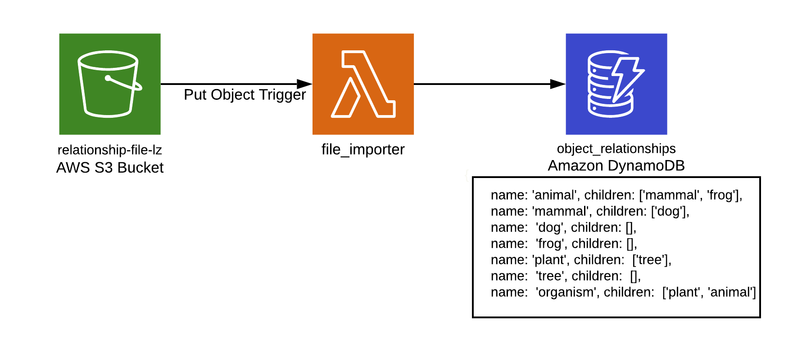

## Overview

This tool waits for a file to land on an s3 bucket. Currently the name is hardcoded, but it could easily be parameterized in the serverless file if I had more time. When a file lands on the bucket, it's read by a python lambda. After the file is read, it's inserted into a dynamodb table with the schema:

```
{ 
    "name": <noun>,
    "children": [<noun>]
}
```

As each file is processed, the most current information will override a record in the dynamodb table. If we wanted to incur the cost of a read and a write, we could perform an upsert instead.


### Tools Used
I used the following tools:
* [Pipenv](https://pipenv-fork.readthedocs.io/en/latest/) - lets me separate dev and build dependencies for compacting lambda deploys.
* [serverless](https://serverless.com) - a framework built on node for generating and deploying cloudformation templates.

### Pre-requisites 
* Install pipenv:  `brew install pipenv`
* Install [docker](https://www.docker.com/products/docker-desktop)
* Install node and npm: `brew install node`
* Install serverless: `npm install`

## Service Resources
This service creates the following resources:
* A bucket named `relationship-file-lz`. If the bucket already exists we can add a plugin for existing buckets and setup an iam role.
* A DynamoDB table named `object_relationships` that uses the `name` field for it's key.
* A lambda named `file-to-dynamo` that triggers when a file is created in `relationship-file-lz`.


### Commands 
* Validate Linting: `npm run pylint`
* Validate serverless config: `pipenv run $(npm bin)/serverless deploy --stage dev --noDeploy`
* Run Tests: `npm run test`
* Deploy stack: `pipenv run $(npm bin)/serverless deploy --stage dev`
